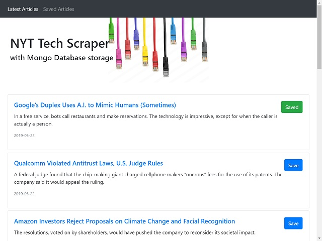
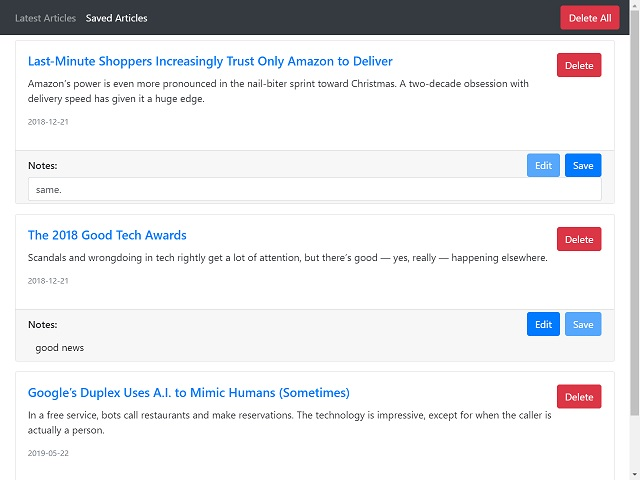

# NYT Tech Scraper
> _Preview current Technology articles from New York Times. Save selected article details and URL in Mongo database_

Mongo Scraper pulls current articles New York Times Technology section. User can choose to save an article's headline, summary, URL, and date to MongoDB. From the "Saved" page, user can leave notes about each article or delete saved articles.

## Deployment
Deployed to [Heroku](https://mdb-scraper.herokuapp.com/)

## Usage 
#### New Articles Page
- Browse latest articles. 
- Click "Save" button to add to Saved Articles List.  
- Saved articles will be indicated with green "Saved" button  

  

#### Saved Articles Page
- Delete All - Delete all saved articles
- Delete - Delete containing article
- Edit - Edit notes for containing article
- Save - Save notes after editing  

## Development setup
Project uses node server environment. If you haven't already, install [Node.js](https://nodejs.org/en/download/)  
  
**Install dependencies:**  
At command line in project directory run: `npm i`  
  
**Test on local server:**  
At command line in project directory run: `node server.js`  
Open browser and navigate to `localhost:3000`

## Technologies Used
- [MongoDB](https://www.mongodb.com/) - Open-source NoSQL database
- [Mongoose](https://www.npmjs.com/package/mongoose) - MongoDB object modeling tool for Node
- [Node.js](https://nodejs.org) - JavaScript server environment
- [Express](https://www.npmjs.com/package/express) - Server framework for Node
- [Cheerio](https://www.npmjs.com/package/cheerio) - HTML parsing and API for traversing/manipulating the resulting data structure
- [Axios](https://www.npmjs.com/package/axios) - HTTP client for Node

## Author
Adam Openbrier
 &bull; [Portfolio](https://www.adamopenbrier.com/portfolio.html)  
 &bull; [GitHub](https://github.com/aOpenbrier)  